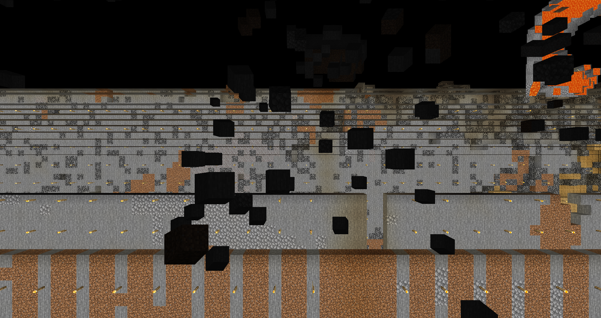
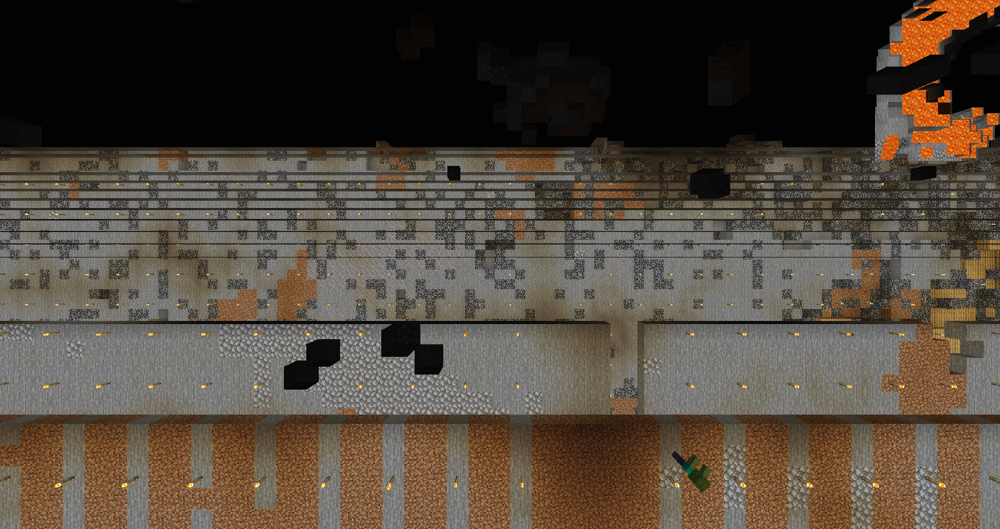
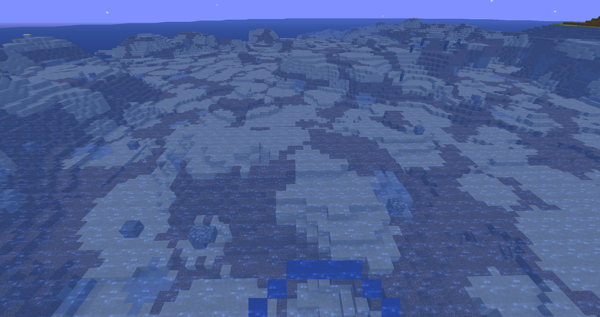

# mc-map-modifier

[](https://github.com/rwarnking/mc-map-modifier/actions/workflows/pytests.yml)
[](https://github.com/marketplace/actions/super-linter)
[](https://github.com/rwarnking/mc-map-modifier/releases/latest)
[](https://github.com/rwarnking/mc-map-modifier/blob/main/LICENSE)

## Description

## Table of Contents

- [mc-map-modifier](#mc-map-modifier)
  - [Table of Contents](#table-of-contents)
  - [What does it do](#list-of-features)
    - [Fill air pockets](#fill-air-pockets)
  - [Installation](#installation)
    - [Dependencies](#dependencies)
  - [Usage](#usage)
    - [GUI](#gui)
    - [Supported Versions](#supported-versions)
  - [How does it work](#how-does-it-work)
    - [Filling algorithm](#filling-algorithm)
    - [Deletion algorithm](#deletion-algorithm)
    - [Replacement algorithm](#replacement-algorithm)
  - [Contributing](#contributing)
  - [Credits](#credits)
  - [License](#license)

## List of Features
This tool has five different functions which can be used to alter the Minecraft
region files (`.mca`).

The selectable functions are:

- [x] Fill air pockets
  - tested values: 1
- [x] Fill block pockets inside the water
  - tested values: 1, 2, 3
- [x] Replace solid areas
  - tested values: 0, 1, 2, 3, 4
  - recommended value: 2
- [ ] Fill a cave at a given position
- [ ] Dig a railway tunnel between a start- and an endpoint

### Fill air pockets
Some older maps might have problems with holes that appear seemingly random. These holes
are most often 1 to 10 blocks in size and create a world that is more like cheese than solid.
Using this modifier air pockets up to a specified size should be removed and filled
either by using simple stone blocks or using a replacement map.

<p float="left">
  <p>
  The left image shows an example of a .mca file where a lot of holes were generated.
  The right image shows the same spot but after applying the algorithm with size 1.

  As can be seen most of the holes where removed, only those of bigger size are still present.
  </p>
  
  
</p>

### Remove water blocks
Similar to the air pockets is it possible for older maps to spawn blocks inside waterbodies.
This might not be recognizable for smaller lakes but for big oceans it is easy to see if there
are some stone blocks without any connection to other solid blocks.
It is most likely that the blocks that create the air-pockets are the same which get placed in
the ocean.
Using this modifier allows to remove these misplaced blocks, replacing them with water.

<p float="left">
  <p>
  The left image shows an example of a .mca file where blocks inside an ocean can be found.
  The right image shows the same spot but after applying the algorithm with size 1.

  As can be seen some of the structures were removed.
  </p>
  
  
</p>

### Replacing blocks
Even though porting an old map to a newer version is possible without any problems,
this does not result in replacement of blocks that are already generated.
This modifier can be used to achieve that. All blocks that are usually found below `y=70`
are checked and replaced if a replacement map is given. The replacement block is received by
looking at the same spot in the replacement map. Therefore it is beneficial to
use the same seed as the original map for the replacement map.
The seed of a map can be obtained by using the ingame command:
```bash
/seed
```
The neighborhood parameter determines the amount of blocks that are between the first
replaced block and an transparent block. This is used to reduce the possibility of
destroying handmade structures. Due to the neighborhood parameter no blocks are
replaced that are visible.

<p float="left">
  
  
</p>

## Installation

Download this repository or install directly from GitHub
```bash
pip install git+https://github.com/rwarnking/mc-map-modifier.git
```

### Dependencies

Use
```bash
pip install -r requirements.txt
```
to install all dependencies.

The main dependency is the anvil tool found here:
[anvil-parser](https://github.com/matcool/anvil-parser)

Further dependencies are mostly computer vision libraries for image processing:
[numpy](https://numpy.org)
[scipy](https://www.scipy.org)
[scikit-image](https://scikit-image.org)
[matplotlib](https://matplotlib.org)

## Usage

### GUI

The GUI gives you options for selecting the directories for input, output and replacement.
Furthermore options are available to enable the different functions and the size of the
modified area.
Progress-bars are given for continuous observation of the progress.


### Supported Versions

Inputfiles upto version 1.16 should be processable.

## How does it work

The algorithm for all modifications can be divided into the following steps:
- classification
- identification
- modification
- copying

The first two steps are calculated for a complete region. This is done to allow for
multiprocessing and prevent borders between chunks where the algorithm would either not
be able to run or would need a extensive special case.

The Idea is, to assign each block to one of two or three groups, such that it is known
whether a block may be of interest and therefore adjusted later, or totally uninteresting
for the given modification.

After that a labeling algorithm is used to get all connected groups of one type.
This allows to loop through all groups and check whether they should be modified.
One possibility is to use the size of the group as a criterion - meaning that for example
is the group is of size one, than it is known that there is a single block of the
given type created by the classification step.

Using this data the modification step loop through all blocks of the region an modifies
the blocks that where identified accordingly.

### Filling algorithm

#### Classification
#### Identification

### Deletion algorithm

### Replacement algorithm

## Contributing

We encourage you to contribute to this project, in form of bug reports, feature requests or code additions. Although it is likely that your contribution will not be implemented.

Please check out the [contribution](docs/CONTRIBUTING.md) guide for guidelines about how to proceed as well as a style guide.

## Credits
Up until now there are no further contributors other than the repository creator.

## License
This project is licensed under the [MIT License](LICENSE).

