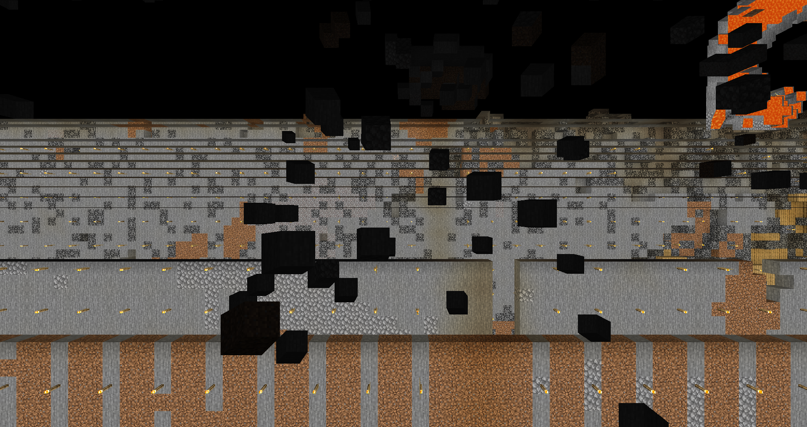
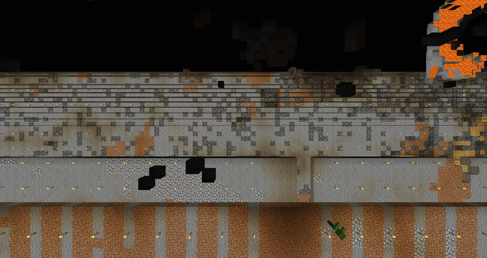

# mc-map-modifier

[](https://github.com/marketplace/actions/super-linter)

## Table of Contents

- [mc-map-modifier](#mc-map-modifier)
  - [Table of Contents](#table-of-contents)
  - [What does it do](#what-does-it-do)
    - [Fill air pockets](#fill-air-pockets)
  - [Installation](#installation)
    - [With Executable](#with-executable)
    - [From Sourcecode](#from-sourcecode)
  - [Usage](#usage)
    - [GUI](#gui)
  - [Supported Versions](#supported-versions)
    - [Config file](#config-file)
  - [How does it work](#how-does-it-work)
    - [Filling algorithm](#filling-algorithm)
    - [Deletion algorithm](#deletion-algorithm)
    - [Replacement algorithm](#replacement-algorithm)
  - [How to contribute](#how-to-contribute)

## What does it do
This tool has five different functions which can be used to alter the minecraft
region files (.mca).

The selectable functions are:

- [x] Fill air pockets
    - tested values: 1
- [x] Fill block pockets inside the water
    - tested values: 1, 2, 3
- [x] Replace solid areas
    - tested values: 0, 1, 2, 3, 4
    - recommended value: 2
- [ ] Fill a cave at a given position
- [ ] Dig a railway tunnel between a start- and an endpoint

### Fill air pockets
Some older maps might have problems with holes that appear seamingly random. These holes
are most often 1 to 10 blocks in size and create a world that is more like cheese than solid.
Using this modifier air pockets up to a specified size should be removed and filled
either by using simple stone blocks or using a replacement map.

<p float="left">
  <p>
  The left image shows an example of a .mca file where a lot of holes were generated.
  The right image shows the same spot but after applying the algorithm with size 1.

  As can be seen most of the holes where removed, only those of bigger size are still present.
  </p>
  
  
</p>

### Remove water blocks
Similar to the air pockets is it possible for older maps to spawn blocks inside waterbodies.
This might not be recognisable for smaller lakes but for big oceans it is easy to see if there
are some stone blocks without any conection to other solid blocks.
It is most likely that the blocks that create the airpockets are the same which get placed in
the ocean.
Using this modifier allows to remove these misplaced blocks, replacing them with water.

<p float="left">
  <p>
  The left image shows an example of a .mca file where blocks inside an ocean can be found.
  The right image shows the same spot but after applying the algorithm with size 1.

  As can be seen some of the structures were removed.
  </p>
  
  
</p>

### Replacing blocks
Even though porting an old map to a newer version is possible without any problems,
this does not result in replacement of blocks that are already generated.
This modifier can be used to achieve that. All blocks that are usually found below y70
are checked and replaced if a replacement map is given. The replacement block is received by
looking at the same spot in the replacement map. Therefore it is beneficiall to
use the same seed as the original map for the replacement map.
The seed of a map can be optained by using the ingame command:
```
/seed
```
The neighbourhood parameter determines the amount of blocks that are between the first
replaced block and an transparent block. This is used to reduce the possibility of
destroying handmade structures. Due to the neighbourhood parameter no blocks are
replaced that are visible.

<p float="left">
  
  
</p>

## Installation

### With Executable

### From Sourcecode

Download this repository or install directly from github
```
pip install git+https://github.com/rwarnking/mc-map-modifier.git
```
and use
```
pip install -r requirements.txt
```
to install all dependencys.

THe main dependency is the anvil tool found here:
[anvil-parser](https://github.com/matcool/anvil-parser)

Further dependencys are mostly computer vision librarys for image processing:
[numpy](https://numpy.org)
[scipy](https://www.scipy.org)
[scikit-image](https://scikit-image.org)
[matplotlib](https://matplotlib.org)

## Usage

### GUI

The Gui gives you options for selecting the directorys for input, output and replacement.
Furthermore options are available to enable the different functions and the size of the
modified area.
Progressbars are given for continuous observation of the progress.


## Supported Versions

Inputfiles upto version 1.16 should be processable.
### Config file

## How does it work

### Filling algorithm

### Deletion algorithm

### Replacement algorithm

## How to contribute
